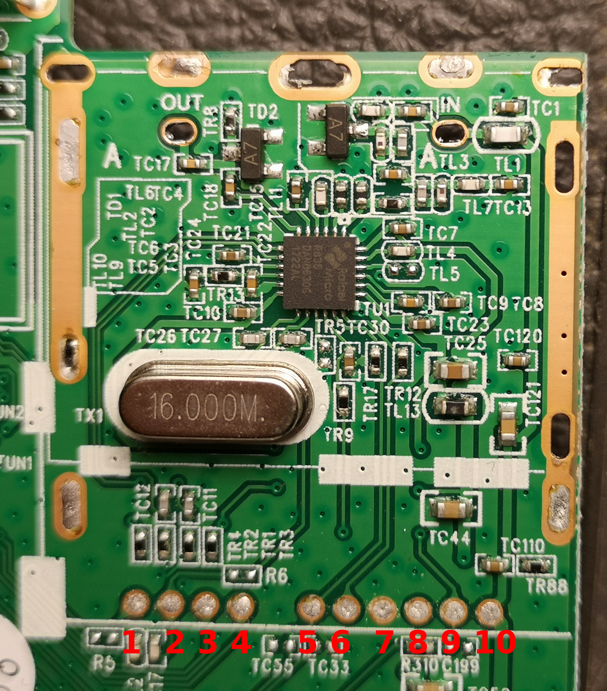

# LinQ DH1692

Decoder DVB-T2 HD

## Specification (as specified by vendor)

- Chip: MSTAR
- VHF frequency range: 117.5-226.5 MHz
- UHF frequency range: 474-866 MHz
- DVB-T2 tuner: R836
- Connection Terminals: HDMI, USB PVR, single SCART, RF IN, RF OUT, Coaxial (SPDIF, ndr)
- Fuction: Receiving television transmissions Analogue and digital delevision

# I2C Address (7bit)

0x1A (0011010)

# I2C Address (8bit)

- 0x34 (00110100): Write Mode
- 0x35 (00110101): Read Mode

# R836 test-point

- 3: I2C SDA
- 4: I2C SDC
- 5: VON (Differential IF output)
- 6: VOP (Differential IF output)
- 7: GND
- 8: VCC +3.3V
- 9: VACG (IF automatic gain control input)

# I2C logs

### power-on

Description: First power on, without any device setup, antenna disconnected

Files:
- power-on.logicdata: Saleae logic analyzer format)
- power-on.csv: Export from Saleae Logic)
- power-on-2.csv: Export from Saleae Logic old version)
- power-on-TV-channel.jpg: TV Screenshot (INFO page)
- power-on-IF-output.jpg: IF spectrum centered to 5.07 MHz, span 10 MHz
- power-on-IF-output-2.jpg: IF spectrum centered to 4.57 MHz, span 10 MHz

Tuning info:
 - Channel: 168, "LA 8"
 - Frequency: 650 MHz
 - BW: 8MHz
 - Mode: DVB-T

# References

https://blog.pasqualefiorillo.it/linq-dh1692-rafael-micro-r836-pinout/
